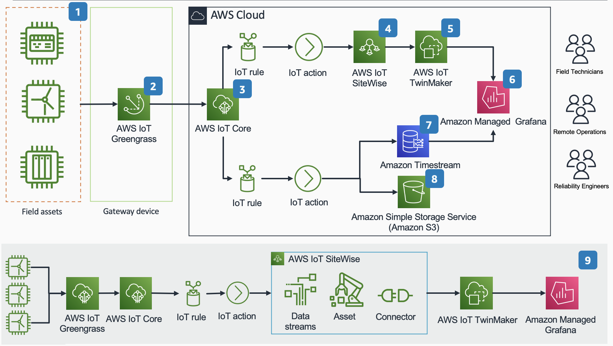

# EnergyKit Toolbox Demo and Workshop CDK Application

This AWS Cloud Development Kit (CDK) application deploys a demo and workshop environment for showcasing the end to end capabilities of AWS EnergyKit Toolbox.

## 🛠 What you will build


Figure 1: Solution Architecture Diagram

As shown in Figure 1: Solution Architecture Diagram, this guidance with sample code sets up the following application stacks

1. EnergyKit embedded software: AWS IoT SDK for Python
2. EnergyKit Edge Gateway: AWS IoT Greengrass Core
3. IoT Stack: AWS IoT Core configuration
4. Industrial IoT Stack: AWS IoT Sitewise asset hierarchy
5. Digital Twin: AWS IoT TwinMaker
6. Visualization Dashboard: Amazon Managed Grafana
7. Timeseries Database: Amazon Timestream
8. Date Lake: Amazon Simple Storage Service

## 💲 Cost and Licenses

You are responsible for the cost of the AWS services used while running this application. There is no additional cost for the kit.

The AWS CDK stacks for this kit include configuration parameters that you can customize. Some of these settings, such as instance type, affect the cost of deployment. For cost estimates, see the pricing pages for each AWS service you use. Prices are subject to change.

Tip: After you deploy the application, create AWS Cost and Usage Reports to track costs associated with the application. These reports deliver billing metrics to an S3 bucket in your account. They provide cost estimates based on usage throughout each month and aggregate the data at the end of the month. For more information, see What are AWS Cost and Usage Reports?

This sample doesn’t require any software license or AWS Marketplace subscription.

## Application Stacks

### Shared Resource Stack

The shared resource stack deploys all cross-stack referenced resources such as S3 buckets and lambda functions that are built as dependencies.

Review the [Shared Resources Stack](stacks/stack-shared-resources/stack-shared-resources.ts) and [Stack Outputs](#shared-resources-stack-outputs)

### IoT Stack

The IoT stack deploys fleet provisioning templates and configurations for IoT thing andIoT Greengrass core device; AWS IoT Sitewise asset models; IoT Core configuration; IoT core control panel API.

### Simulator Stack

The Simulator Stack deploys an auto-scaling group of EC2 instances configured with Node-RED and a turbine simulator script.

### Web Stack

The Web Stack deploys an AWS Amplify Web Application with integrated cognito user pool.

## 🚀 How to Deploy

You can deploy AWS IoT EnergyKit demo and workshop reference deployment through the manual setup process using AWS CDK. We recommend use of an AWS Cloud9 instance in your AWS account or VS Code. We also recommend that you use a fresh AWS account for your deployment.

## 🎒 Pre-requisites

The [aws-cli](https://docs.aws.amazon.com/cli/latest/userguide/cli-chap-install.html) must be installed -and- configured with an AWS account on the deployment machine (see <https://docs.aws.amazon.com/cli/latest/userguide/cli-chap-install.html> for instructions on how to do this on your preferred development platform).

This project requires [Node.js](http://nodejs.org/). To make sure you have it available on your machine, try running the following command.

```sh
node -v
```

For best experience we recommend installing CDK globally: `npm install -g aws-cdk`

## 🚀 Setup

### 0/ Use git to clone this repository to your local environment

```sh
git clone #insert-http-or-ssh-for-this-repository
```

### 1/ Set up your AWS environment

Configure your AWS credentials:
`aws configure`

For more on setting up your AWS Credentials please visit [setting up your aws credentials](https://docs.aws.amazon.com/cli/latest/userguide/cli-chap-configure.html)

### 2/ Prepare your CDK environment

1. Navigate to CDK Directory
2. Copy `cdk.context.template.json` or remove .template
3. Enter your parameters in `cdk.context.json` (see Context Parameters below)

Please note this context file will be gitignored by default to prevent accidental configuration overwrites. If you wish you enable a persistent configuration please disable git ignore of `cdk.context.json` by editing `.gitignore`

#### --Context Parameters--

Before deployment navigate to `cdk.context.json` and update the required context parameters. Review the optional and required context variables below.

- Required:`adminEmail` The email address for the administrator of the app
- Required: `awsRegion` Specified AWS region
- Required: `adminEmail` The email address for the administrator of the app
- Required: `wifiSsid` SSID for WiFi used in
- Required: `projectName` Name of the project
- Required: `energyCategory` Select from `wind`,`soloar`,`hydro`
- Required: `deployIotStack` Determines whether this stack is deployed. Default is false, change to `true` if you want to deploy this stack.
- Required: `deployTwinmakerStack` Determines whether this stack is deployed. Default is false, change to `true` if you want to deploy this stack.
- Required: `deployWebStack` Determines whether this stack is deployed. Default is false, change to `true` if you want to deploy this stack.
- Required: `deploySimulatorStack` Determines whether this stack is deployed. Default is false, change to `true` if you want to deploy this stack.
- Required: `workshopOption` Determines whether this stack is deployed. Default is false, change to `true` if you want to deploy this stack.
- Required: `nagEnabled` Enables cdk_nag audit tool. Default is `true`.
- Required: `APP_ENV` Sets the application environment to `DEV` or `PROD`. DEV includes ephemeral resources that will default to destroy on delete. PROD preserves all data stores even on delete to prevent accidental data destruction. Default is `DEV`.

### 3/ Bootstrap CDK

At this point you should have already saved your AWS credentials to environmental variables using `aws configure` or a similar command. The bootstrap step sets up several dependencies for CDK that will allow you to create resources using the CDK command line interface. Please also note that you will need a generally permissive IAM role to bootstrap CDK. This can be done using an AWS managed developer role, but we strongly recommend consulting your security practices to ensure that you adhere to least privilege.

```sh
cdk bootstrap # if you are authenticated with aws configure
```

or

```sh
cdk bootstrap aws://ACCOUNT-NUMBER/REGION # if you are bootstrapping a different account
```

### 3/ Install dependencies, build, and synthesize the CDK app

Install dependencies

```sh
npm ci
```

Build your node application and environment

```sh
npm run build
```

Synthesize the CDK application

```sh
cdk synth
```

### 4/ Create a secret to store the password for the Wifi network used by your devices

#### a/ To create a new secret:

```sh
aws secretsmanager create-secret --name IOT_WIFI_PASSWORD \
    --description "RaspberryPiWifiPassword" \
    --secret-string 'REDACTED'
```

#### b/ To update an existing secret:

```sh
aws secretsmanager update-secret \
    --secret-id 'IOT_WIFI_PASSWORD' \
    --secret-string 'REDACTED'
```

### 6/ Deploy the application

✅ Recommended: deploy for local development

```sh
cdk deploy --all
```

### 7/ Optional: Set up the Amplify Web Application

If you are reading this it is because you deployed the EnergyKit Web Application by setting `deployWebStack: true` in the `cdk.context.json` file. Your application is already up and running in the AWS Cloud and there are a few simple steps to begin working with and editing your application.

1. Visit the AWS Amplify Console by navigating to the AWS Console and searching for Amplify. Make sure you are in the same region that you just selected to deploy your application.
2. Visit your live web application --> click on the link in the Amplify console

   When you open the web application in your browser you should see a cognito login page with input fields for an email address and password. Enter your email address and the temporary password sent to your email when you created the EnergyKit CDK Application. After changing your password, you should be able to sign in successfully at this point.

   If you you need to set up a new user you can also navigate to the Cognito service in the AWS console, set up a new user, activate and set your password, and you will be able to use this new login with your Amplify application.

   **_NOTE: The sign-up functionality is disabled intentionally to help secure your application. You may change this and add the UI elements back, or manually add the necessary users in the cognito console while following the principle of least privilege (recommended)._**

3. Learn more about working with [AWS Amplify CLI](https://docs.amplify.aws/cli/) or the [AWS Amplify Console](https://docs.amplify.aws/start/q/integration/js/).
4. Make the web application your own and let us know what you choose do to with it.

Success! At this point, you should successfully have the Amplify app working.

## 🛠 Usage

Time to get started using AWS IoT EnergyKit! Follow the steps below to see if everything is working and get familiar with this solution.

### 1/ Make sure all the infrastructure deployed properly

In your command line shell you should see confirmation of all resources deploying. Did they deploy successfully? Any errors or issues? If all is successful you should see indication that CDK deployed. You can also verify this by navigating to the Cloudformation service in the AWS console. Visually check the series of stacks that all begin with `EnergyKit` to see that they deployed successfully.

### 2/ Utilize the EnergyKit Simulator Node-Red Instances

This application deploys `n` (3 is default) EC2 micro instances running a simple turbine data simulator as a Greengrass Client device (IoT Thing/EnergyKit turbine). These simulators run on Node-Red for simple modification and management, and connect to a separate EC2 instance running Greengrass. This architecture is a virtualized parallel to the Physical Edge and Embedded devices outlined below. This simulator serves as a cloud-based testing and laboratory environment that can operate in parallel to physical devices. If you do not plan to deploy Physical devices you can complete this section and begin working with the architecture. If you wish to work only with physical devices you can skip to the next step. If you wish to work with both read on:

The node-red instances are deployed using an EC2 auto-scaling group. To log in to the node-red simulators:

1. Navigate to the EC2 service in the AWS console
2. Select **Instances (running)**
3. You will see several instances all with the same name: `SimulatorStack/NodeRedSimulator/SimulatorASG`
4. Select one instance by clicking on the **Instance ID**
5. Select **Networking** from the center menu bar
6. Here you will find your device's public IP address
7. Copy this address or select **open address**
8. To login to the node-red instance for each server use your browser and navigate to `<instance-public-ip-address>/node-red`

Please note: you do not need to modify these Node-red instances, so you are not required to log in to all of them. We do, however, recommend logging in and changing the password on each as a security measure and best practice.

Log in to the instances using the default password and username below. We recommend changing these immediately after login:

```
username: admin
password: password
```

Once working in the node-red environment follow the annotations and prompts to work with data, stop and start the simulations, and modify the randomization algorithms for the simulations. Please note that the algorithms operate with a purely randomized range of data, and are not meant to accurately represent realistic wind turbine data.

By default the simulators will connect to the Greengrass core device and run at startup.

### 3/ Provision your Greengrass Core Device with the Greengrass Vending Machine

The EnergyKit CDK application has built a custom machine image to provision your Raspberry Pi based Greengrass core device with a pre-built and ready to go deployment package. That includes MQTT Broker, MQTT Bridge, AWS Client Device Discovery, AWS Systems Manager, and AWS Greengrass CLI components. This core device is provisioned to create it's own certificate and core device name, connect and set up a deployment, and begin sending and receiving MQTT messages as a bridge. Take the following steps to set up this device:

1. Navigate to AWS Codepipeline in the AWS Console
2. Select the Greengrass code pipeline
3. Select the final S3 step
4. Go to this S3 bucket and download the machine image file
5. Use [Balena Etcher](https://www.balena.io/etcher/) to flash your machine image to a mini SD card
6. Insert the mini SD card into your Raspberry Pi 4 8GB
7. This will...
   - Automatically install a Raspios Lite image running the latest stable Raspios release
   - Install all Greengrass core device dependencies
   - Install the Greengrass Nucleus software
   - Use Greengrass Fleet Provisioning plugin to provision the device as a new Greengrass core device when it first connects
   - Deploy a prebuilt Greengrass group deployment to the target group
8. When this process has completed navigate to the AWS console and search AWS IoT Greengrass. You should now see a new greengrass core device with the prefix `energykit-ggcd-{deviceSerialNumber}`. Great! It worked. Your Greengrass core device is set up and connected and should now be receiving a deployment. Go to deployments just to double check.

### 4/ Provision your EnergyKit Embedded Greengrass Client Devices with IoT Vending Machine

EnergyKit is compatible with several Debian-based linux distributions, but we recommend Raspberry Pi Zero W hardware. If you are working with all recommended kit items this is what you will have. The CDK application builds a custom machine image for automating deployment of Rpi embedded devices. These devices are embedded inside of energy assets and contain code that sends sensor telemetry to the Greengrass core device, and eventually to to cloud, and listens for commands coming from the cloud. We separate these packages into sensing and actuating. The next step in setup is to start deploying and provisioning your greengrass client devices, also knowns as EnergyKit embedded.

1. Navigate to AWS Codepipeline in the AWS Console
2. Select the IoT Thing code pipeline
3. Select the final S3 step
4. Go to this S3 bucket and download the machine image file
5. Use [Balena Etcher](https://www.balena.io/etcher/) to flash your machine image to a mini SD card
6. Plug your sd card into your client device
7. This will...
   - Automatically install a Raspios Lite image running the latest stable Raspios release
   - Install all EnergyKit Embedded core device dependencies
   - Use AWS IoT SDK for Python Fleet Provisioning to provision the device as a new AWS IoT Thing when it first connects
   - Use pre-provisioning hooks to check the device type and register the device as a Wind Turbine with associated data model and associate the client device with the Greengrass device to allow for cloud-based discovery for MQTT bridge communication
   - Send an SNS notification to the stack admin (defined in `cdk.context.json`) with a notification that the device has been provisioned
   - Using post-provisioning hooks update add an AWS IoT Sitewise Asset with data model and stream aliases for all EnergyKit data points
   - Using post-provisioning hooks add the energy asset to simulator and telemetry Twinmaker Scenes and Grafana Dashboards
8. The provisioning process and dependency installation takes 5-10 minutes depending on your network throughput and bandwidth
9. After 5-10 minutes you should see new IoT things show up in the AWS IoT Core console with the prefix `energykit-{assetType}-{deviceSerialNumber}` for example `energykit-turbine-abc123456`

### 4/ Test Your Embedded Device Setup

Start by sshing into your energykit embedded device. Pick one to start.

```sh
ssh turbine@<your-turbine-hostname>
# Accept new Fingerprent
# Enter password (default is EnergyKit)
chmod 755 ../../etc/energykit-embedded # modify permissions to allow you to read and execute
```

🧪 Test that all i2c sensors are connected and working

```sh
python3 energykit-test.py
```

## 🧪 Tests

### Static development security test

You can test your code locally by running python `bandit`, `cdk_nag`, `git-secrets`. This runs tests locally to check for common security violations and well-architected architectural patterns. Outputs are saved as ignored files at the top level directory under `cdk_nag_summary.log` and `bandit_test_output.log`.Remediation of all warnings and errors should be taken through warning suppression, or by remediating the actual problem. Please note that any suppressed warnings will require extensive justification aligned to well-architected pillars as in-line comments.

```sh
npm run secure
```

## 📚 Reference & Resources

### Helpful Commands for CDK

- `npm run build` compile typescript to js
- `npm run watch` watch for changes and compile
- `npm run test` perform the jest unit tests\
- `cdk diff` compare deployed stack with current state
- `cdk synth` emits the synthesized CloudFormation template
- `cdk deploy --all` deploy this stack to your default AWS account/region w/o the CICD pipeline

### Data Model

#### Sensor Reading Model

The data models below describe the input and output json models for communication between EnergyKit embedded devices and AWS.

Sensor reading data model:

```json
{
  "sensorTimestamp": "",
  "assetId": "",
  "temp": "",
  "pressure": "",
  "humidity": "",
  "altitude": "",
  "current": "",
  "voltage": "",
  "power": "",
  "rpm": "",
  "gearboxVibration": "",
  "city": "",
  "country": "",
  "countryCode": "",
  "zip": "",
  "lat": "",
  "long": "",
  "region": "",
  "status": "",
  "lastMaintenance": ""
}
```

Command data model

```json
{
  "simulate": "1/0",
  "anomaly": "True/False"
}
```

## 👀 See also

- Greengrass Guide
- AWS IoT

## 🔐 Security

See [CONTRIBUTING](CONTRIBUTING.md#security-issue-notifications) for more information.

## Reference & Resources

### Helpful Commands for CDK

- `npm run build` compile typescript to js
- `npm run watch` watch for changes and compile
- `npm run test` perform the jest unit tests\
- `cdk diff` compare deployed stack with current state
- `cdk synth` emits the synthesized CloudFormation template

## Troubleshooting

### A/ Turbines do not connect via MQTT and successfully send data

#### Diagnosis

1. ssh into greengrass core device and tail logs using these steps:
   1. Connect to YourWifiSsid (or LAN used by devices if different)
   2. ssh greengrass@<core-device-thing-name>.lan and/or IP address if router does not resolve local hostnames
   3. password EnergyKit
   4. sudo tail -f /greengrass/v2/logs/greengrass.log
2. Keep this terminal open while you do the following…
3. Turn each turbine off, then on.
4. ssh into each turbine using these steps
   1. Connect to YourWifiSsid (or LAN used by devices if different)
   2. Check your turbine thing-names in the AWS console or on your local network. The physical turbines are the things that begin with turbine-.... and DO NOT have the term “simulator“ in them
   3. ssh turbine@<turbine-thing-name> and/or IP address if router does not resolve local hostnames
   4. password EnergyKit
5. Check turbine setup and pubsub logs
   1. sudo cat /etc/energykit-embedded/logs/provision-setup.log
   2. `sudo tail -f /etc/energykit-embedded/logs/provision-setup.log`
   3. sudo cat /etc/energykit-embedded/logs/pubsub.log
6. Check status of systemctl startup script
   1. sudo systemctl status awsiotpubsub
   2. sudo cat /etc/systemd/system/awsiotpubsub.service
7. check the status of systemctl script
8. Try running telemetry script

To test communication run the telemetry script, but first make sure:

- The greengrass core device is online and connected
- SSH into the device and tail the logs so that you can see what is going on
- SSH into each each turbine and execute the following command...

```sh
python3 /etc/energykit-embedded/energykit_run_telemetry.py
#you may have to use chmod +x /etc/energykit-embedded/energykit_run_telemetry.py if you get a permission error
```

As a result of this action you should see that each device connects and authenticates with your greengrass core device in the greengrass logs. You should also see each device sending mqtt messages and printing them to the console that you are sshed into. If you receive any errors in this process it is likely because a sensor is not connected.

IF telemetry does not run:

### A/ I2C is not working as expected

If you receive errors about devices not being found at an i2c address you may need to make some changes to the i2c setup.

Start by checking that i2c is enabled.

```sh
sudo i2cdetect -y 1
```

The readout should show four i2c addresses with devices enabled

```sh
     0  1  2  3  4  5  6  7  8  9  a  b  c  d  e  f
00:                         -- -- -- -- -- -- -- --
10: -- -- -- -- -- -- -- -- 18 -- -- -- -- -- -- --
20: -- -- -- -- -- -- -- -- -- -- -- -- -- -- -- --
30: -- -- -- -- -- -- -- -- -- -- -- -- -- -- -- --
40: -- -- -- 43 -- -- -- -- -- -- -- -- -- -- -- --
50: -- -- -- -- -- -- -- -- -- -- -- -- -- 5d -- --
60: -- -- -- -- -- -- -- -- -- -- -- -- -- -- -- --
70: -- -- -- -- -- -- -- 77
```

Breakout boards should be enabled at the following addresses:

- 43 INA219 voltage and current monitor from uninterruptible power supply
- 0x18 LIS3DH triple axis accelerometer
- 0x77 BME280 temperature, humidity
- 0x5D Qwiic SCMD dual motor driver

If you receive any errors during this setup process

```sh
# enable the i2c bus
sudo raspi-config nonint do_i2c 0

# set up i2c for the boards and devices used
sudo sh /etc/energykit-embedded/setup/i2c-setup.sh

# check i2c again to ensure that it is connected
sudo i2cdetect -y 1
```

### B/ Startup Pubsub Script is Masked

The cause of this issue is currently unknown but it can be solved by simply manually creating a new startup script following the commands below.

To test communication run the telemetry script, but first make sure:

- The greengrass core device is online and connected
- SSH into the device and tail the logs so that you can see what is going on
- SSH into each each turbine and execute the following command...

```sh
python3 /etc/energykit-embedded/energykit_run_telemetry.py
#you may have to use chmod +x /etc/energykit-embedded/energykit_run_telemetry.py if you get a permission error
```

As a result of this action you should see that each device connects and authenticates with your greengrass core device in the greengrass logs. You should also see each device sending mqtt messages and printing them to the console that you are sshed into. If you receive any errors in this process it is likely because a sensor is not connected.

To permanently replace the startup scrip SSH into each turbine and execute the following commands...

```sh
sudo systemctl daemon-reload

sudo echo "
[Unit]
Description=awsiotpubsub Service
After=network.target
[Service]
Type=idle
User=turbine
ExecStart=/usr/bin/python3 /etc/energykit-embedded/energykit_run_telemetry.py
Restart=always
[Install]
WantedBy=multi-user.target
" > /lib/systemd/system/awsiotpubsub.service
sudo systemctl enable energykitiotpubsub.service
sudo systemctl daemon-reload
```

Reboot the raspberry pi by either unplugging it and plugging back in or by entering sudo reboot in the terminal window

The expected behavior now is that each turbine should automatically connect to Greengrass core via client auth, send mqtt messages, and respond to mqtt commands.
