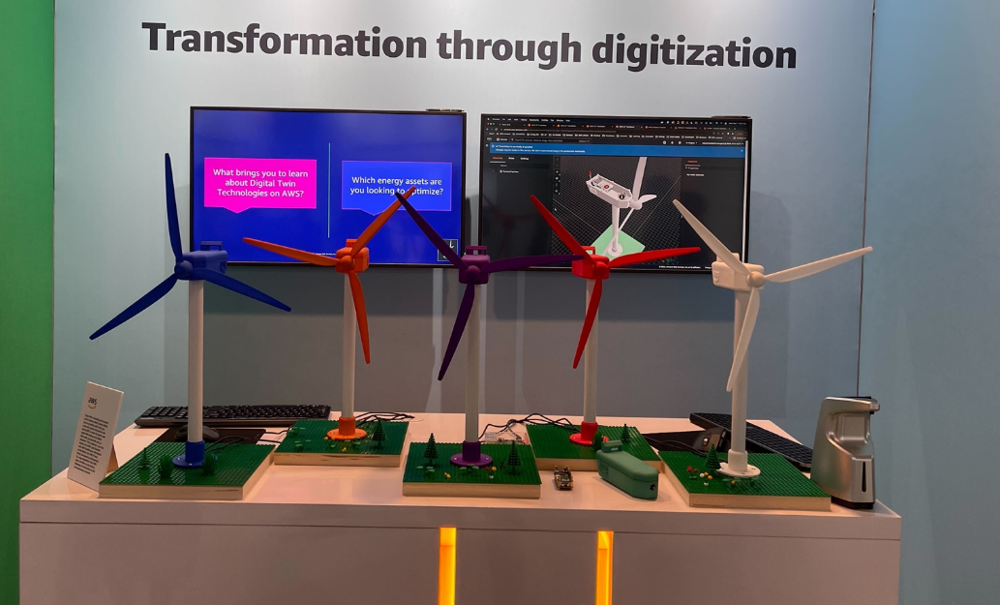
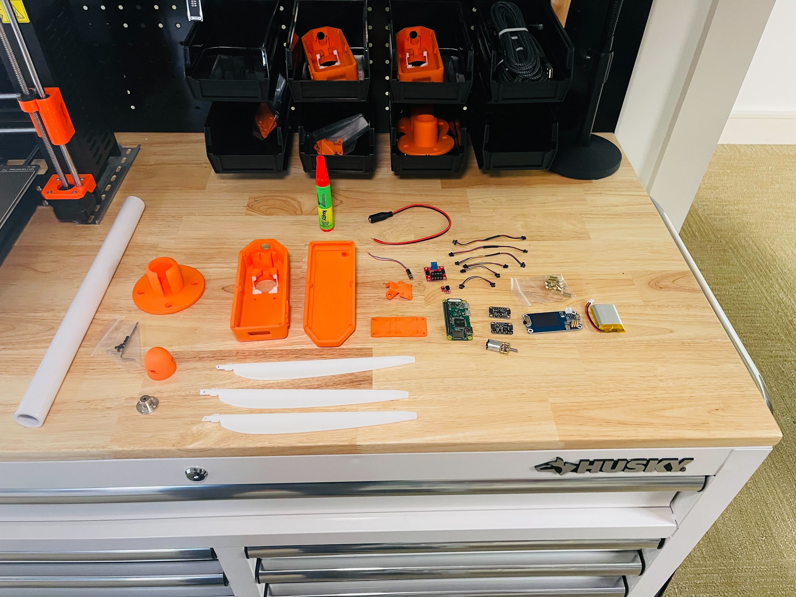
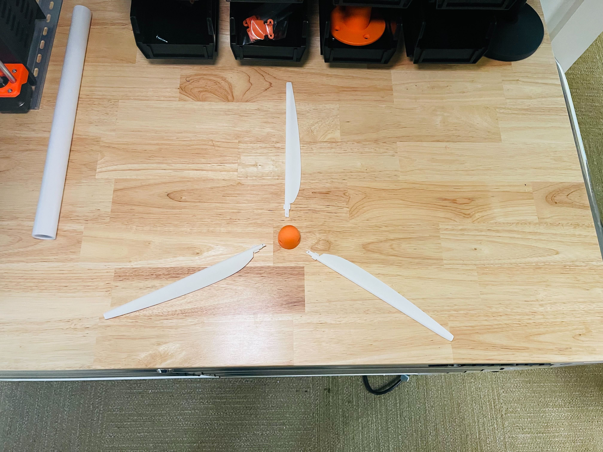
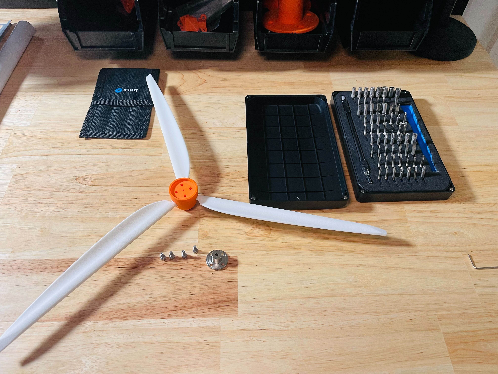
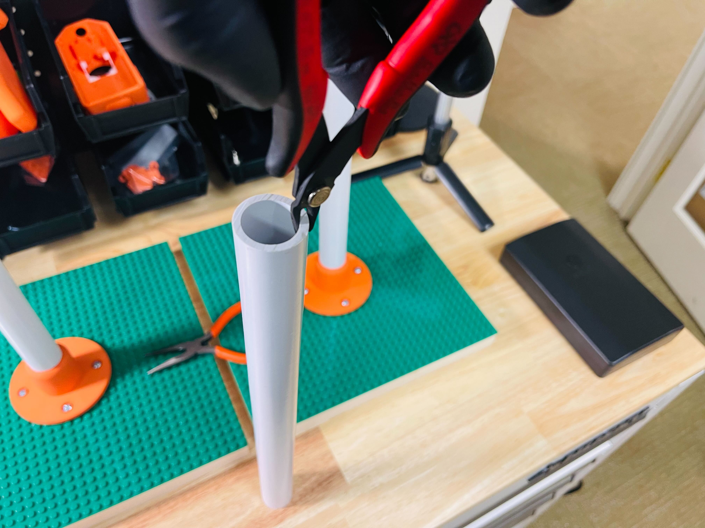
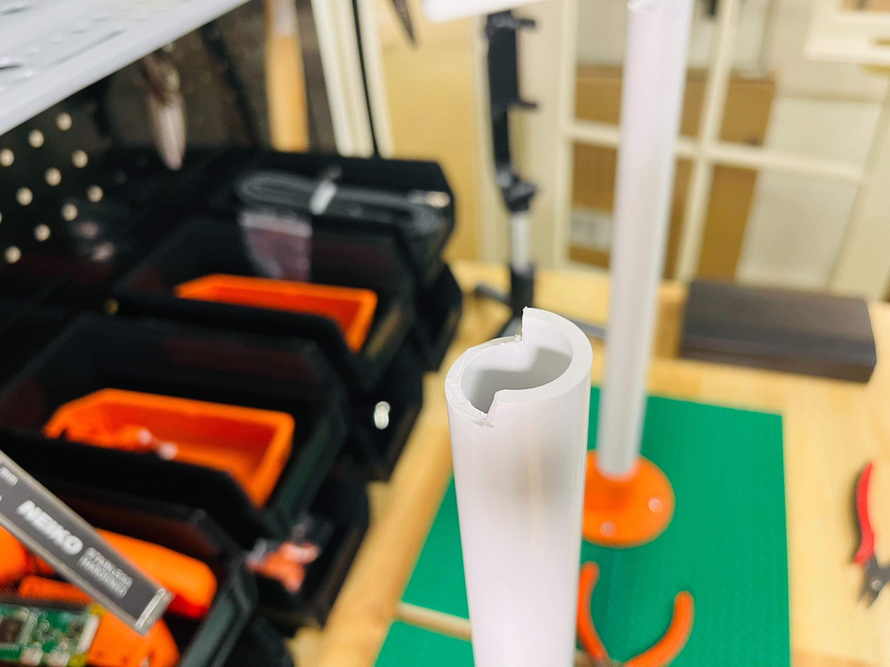
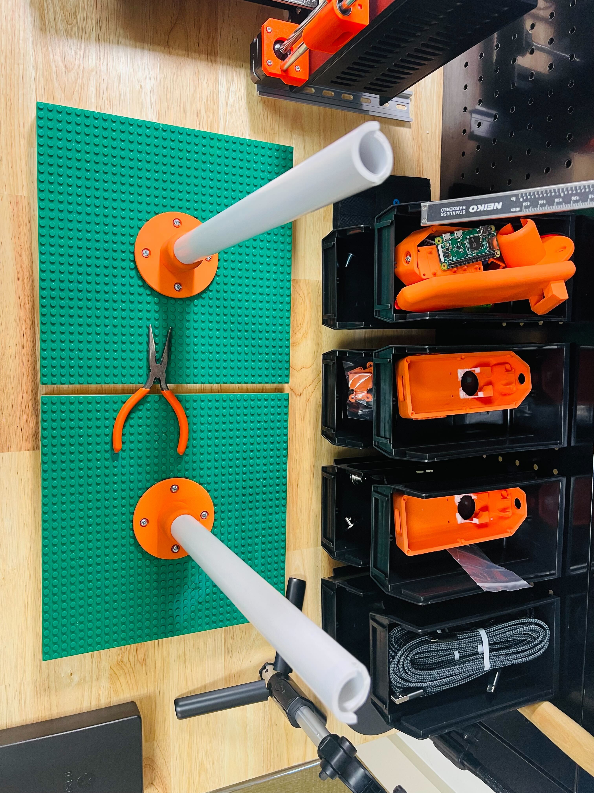
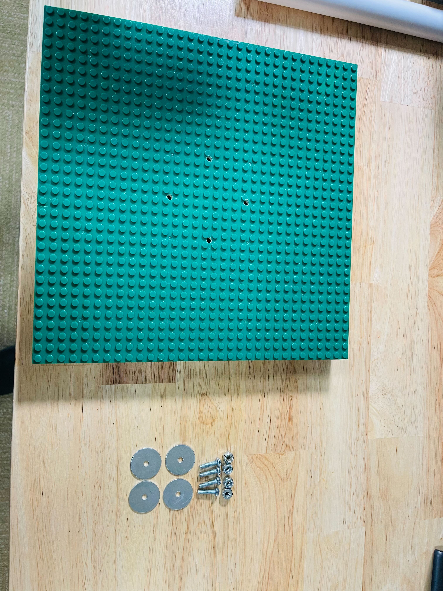
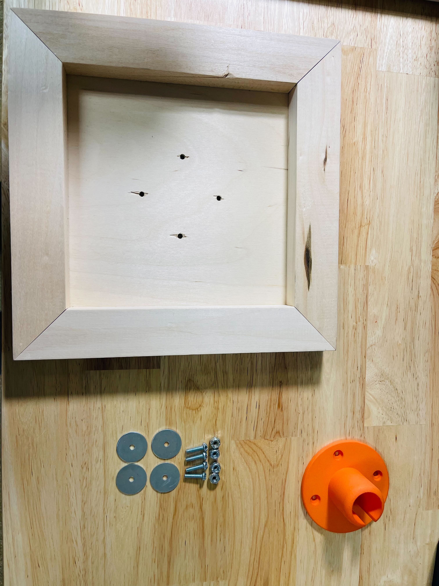

# Welcome to AWS IoT EnergyKit Wind Turbine 3D and Physical Assets

AWS IoT EnergyKit Wind Edition is a collection of 3D assets that can be assembled into a scaled working model wind turbine with embedded sensing, actuating, and IoT communication with AWS IoT services. This documentation covers all steps for assembling physical turbines and digital twin models of turbines.

## 🛠 What you will build

1. Physical 3D Printed Scaled wind Turbines
2. IoT EnergyKit Embedded Hardware Device
3. IoT EnergyKit Digital 3D assets

### 1/ 3D Printed Scaled Wind Turbines
This set of wind turbines stands 400mm tall and runs on a 6v DC motor. It includes an embedded hardware device, sensors, and connects to your network via Wifi.

### 2/ Embedded Hardware Device
This embedded hardware device is a linux-based PLC running a customer Debian image with AWS IoT SDK. The board will run on any Linux distro, and we recommend and provide designs for a Raspberry Pi Zero W board with a breakout triple axis accelerometer, temperature and humidity sensor, and motor driver board. The motor driver powers a DC motor to simulate turbine rotation and a vibration motor to simulate vibration anomalies.

### 3/ Digital 3D Assets
These 3D assets can be printed either with a home 3D printer or with a commercial outsourced printing service. The cover turbine base, blade assembly, nacelle, embedded system and sensor assemble, and motor assembly.

## What it does

IoT EnergyKit Wind Edition is a fully functional 3D printed scaled wind turbine with a linux-based embedded sensing and actuating unit, with a simulated generator run by a 6v DC motor. The kit  The kit also includes `.STEP` and `.gltb` versions of assets 

### Capabilities

The following list of capabilities covers current capabilities as recorded and updated August 2022:

1. Turbines rotate clockwise and counterclockwise with a 6V dc barrel jack power supply
2. Turbines connect to local network via wifi
3. Turbines can be powered on and off and run for 30 minutes on a UPS battery
4. Turbines provide xyz acceleration, humidity, temp, altitude
5. RPM readouts are based on power input only
6. Turbines can be run with on/off commands, true/false vibration anomaly selection, and 

### Limitations

The following list of limitations covers current known functional limitations as recorded and updated August 2022:

1. Turbines have not been tested for extended runtimes or extreme intervals of on/off commands. We cannot guarantee reliability of motors and do not recommend high volume usage for long durations of time.
2. Currently the turbines only connect to IoT services via Greengrass core
3. Currently the turbines do not read out rpm, instead relying on rpm output from PWM module
4. Current triple axis accelerometer readings cannot be adjusted for frequency

## 💲 Cost and Licenses

You are responsible for the cost of the AWS services used while running these models. There is no additional cost for using this sample.

As always we recommend that you create AWS Cost and Usage Reports to track costs associated with the running AWS services. These reports deliver billing metrics to an S3 bucket in your account. They provide cost estimates based on usage throughout each month and aggregate the data at the end of the month. For more information, see  What are AWS Cost and Usage Reports?

This sample doesn’t require any software license or AWS Marketplace subscription.

## How to Build

You can build your own physical wind turbines and your own AWS IoT TwinMaker visualizations, scenes, and dashboards. This README covers building your own turbines by printing them with your own 3D printer or with outsourced 3D printing. Please note that acquiring all necessary parts listed in the Bill of Materials can take time depending on supply chain availability. Currently this model is only tested and verified for the parts listed. If you choose to substitute parts you will be responsible for modifying the configuration and software.

## 🎒 Pre-requisites

- Acquire all items described in the Bill of Materials
- You will need a local Wifi network that allows new devices to connect and allows communication and discovery over NMAP and SSH
- We recommend assembling physical models in a clean quiet place with a least 2m

### 📝 Bill of Materials

|Item|Count|
|---	|---	|
|Turbine Nacelle Bottom	|1	|
|Turbine Nacelle Top	|1	|
|Turbine Baseplate	|1	|
|EnergyKit Sensor Mount	|1	|
|EnergyKit Motor Mount	|1	|
|PVC Pipe for Tower	|1	|
|[Raspberry Pi 4 + 8 GB](https://www.raspberrypi.com/products/raspberry-pi-4-model-b/)	|1	|
|[Optional: Raspberry Pi Case (2)](https://www.amazon.com/ElectroCookie-Raspberry-Aluminum-Cooling-Changing/dp/B09QG349ZL/ref=sr_1_3?crid=TMR96U0JGALM&keywords=raspberry+pi+light+case&qid=1662746255&sprefix=raspberry+pi+light+cas%2Caps%2C86&sr=8-3)	|1	|
|[Raspberry Pi Zero W](https://www.raspberrypi.com/products/raspberry-pi-zero-w/)	|1	|
|[Sandisk Micro SD (32GB)](https://www.amazon.com/SanDisk-Ultra-UHS-I-Memory-Adapter/dp/B00M55C0NS/ref=sr_1_8?crid=2JJ7L0S4P4T2V&keywords=sandisk%2Bmicro&qid=1662746180&sprefix=sandisk%2Bmicro%2Caps%2C91&sr=8-8&th=1)	|2	|
|[M2-3 Screw Kit (Socket Cap)](https://www.amazon.com/VIGRUE-Washers-Assortment-Machine-Threaded/dp/B09ZHHSY92/ref=sr_1_1_sspa?crid=PQJYSHJGUX38&keywords=m2-3+screws&qid=1662746288&sprefix=m2-3+%2Caps%2C96&sr=8-1-spons&psc=1&spLa=ZW5jcnlwdGVkUXVhbGlmaWVyPUFPMkJVSEcyVUM2TUQmZW5jcnlwdGVkSWQ9QTAzNTMyNjYxUk5TNzlYUEM3WlI4JmVuY3J5cHRlZEFkSWQ9QTA1MzM2NzlMOENQM0ZDT00xOFcmd2lkZ2V0TmFtZT1zcF9hdGYmYWN0aW9uPWNsaWNrUmVkaXJlY3QmZG9Ob3RMb2dDbGljaz10cnVl)	|1	|
|[M2-3 Screw Kit (Pan Head Self Tapping)](https://www.amazon.com/HELIFOUNER-Phillips-Computer-Self-Tapping-Electronic/dp/B081DVZMHH/ref=sr_1_5?crid=PQJYSHJGUX38&keywords=m2-3+screws&qid=1662746288&sprefix=m2-3+%2Caps%2C96&sr=8-5)	|1	|
|[3mm x 2mm Magnets](https://www.amazon.com/gp/product/B08NZTN426/ref=ppx_yo_dt_b_search_asin_title?ie=UTF8&psc=1)	|1	|
|[Waveshare UPS Hat](https://www.amazon.com/dp/B093SYMRQG?ref=nb_sb_ss_w_as-reorder-t2_ypp_rep_k0_1_11&&crid=2BF3GDPMIYDAS&&sprefix=waveshare+u)	|1	|
|[Adafruit BME280](https://www.adafruit.com/product/2652)	|1	|
|[Adafruit LIS3DH](https://www.adafruit.com/product/2809)	|1	|
|[Adafruit AW9523 GPIO Expander and LED Driver Breakout - STEMMA QT / Qwiic](https://www.adafruit.com/product/4886)	|1	|
|[SparkFun Qwiic or Stemma QT SHIM for Raspberry Pi / SBC](https://www.adafruit.com/product/4463)	|1	|
|[Sparkfun ROB-15451 (Motor Driver)](https://www.sparkfun.com/products/15451)	|1	|
|[6v 100rpm Micro Metal Gearmotor](https://www.amazon.com/gp/product/B07FVNQZY6/ref=ppx_yo_dt_b_search_asin_title?ie=UTF8&psc=1)	|1	|
|[Stemma QT Qwiic JST Cable (100mm)](https://www.adafruit.com/product/4210)	|3	|
|[5 Outlet Cord Splitter (Cable Matters)](https://www.amazon.com/gp/product/B07QKFKXYB/ref=ewc_pr_img_3?smid=A1AMUYYA3CT6HJ&psc=1)	|1	|
|[Lego Baseplate](https://www.amazon.com/dp/B01CO2NPKS?pd_rd_i=B01CO2NPKS&pd_rd_w=qswAP&pf_rd_p=7672bfb7-93b0-4322-b745-2104db09c4df&pd_rd_wg=f5zB4&pf_rd_r=68AZ0T0T31GGWEQN9PBJ&pd_rd_r=036c7a82-33ad-4b75-9873-05bec71c5b30&th=1) (Set of 4 Stick-on)	|1	|
|[10"x10" Wood Painting Panel (Set of 4)](https://www.amazon.com/Worown-Canvas-Boards-Painting-Pouring/dp/B09T619P9P/ref=sr_1_1_sspa?crid=3332C7QTF7GSV&keywords=10%22%2B10%22%2Bpainting%2Bwood%2Bpanel&qid=1652711385&sprefix=10%2B10%2Bpainting%2Bwood%2Bpanel%2Caps%2C80&sr=8-1-spons&spLa=ZW5jcnlwdGVkUXVhbGlmaWVyPUEyQldQNkdXTk9TSlhRJmVuY3J5cHRlZElkPUEwMDU3MjM1U1dUMjlaR0c3NUlDJmVuY3J5cHRlZEFkSWQ9QTAxNDA4MjkyQk1QNFFHUk4yTENPJndpZGdldE5hbWU9c3BfYXRmJmFjdGlvbj1jbGlja1JlZGlyZWN0JmRvTm90TG9nQ2xpY2s9dHJ1ZQ&th=1)	|1	|
|[10 Port USB Charge Block](https://www.amazon.com/gp/product/B00OJ79UK6/ref=ppx_yo_dt_b_search_asin_title?ie=UTF8&psc=1)	|1	|
|[10 ft. USB C to USB A Cable (3 pack)](https://www.amazon.com/dp/B07QKTLJ96/ref=sspa_dk_detail_4?psc=1&pd_rd_i=B07QKTLJ96&pd_rd_w=dUq9C&pf_rd_p=0c758152-61cd-452f-97a6-17f070f654b8&pd_rd_wg=dSLkd&pf_rd_r=DZA8G2W6MF2ZPYXQ624B&pd_rd_r=cbdf2637-46e2-4c4a-af0f-1894471f639a&s=wireless&spLa=ZW5jcnlwdGVkUXVhbGlmaWVyPUEzU0lLTlFRUk1EU1hBJmVuY3J5cHRlZElkPUEwNjYzOTYzM1BaRk1SWVEyRThSRSZlbmNyeXB0ZWRBZElkPUEwMjU5NDc5MjNZNUE0VUxDQjhMNyZ3aWRnZXROYW1lPXNwX2RldGFpbCZhY3Rpb249Y2xpY2tSZWRpcmVjdCZkb05vdExvZ0NsaWNrPXRydWU=)	|1	|
|[10 ft. Micro USB to USB A Cable Pack (3 pack)](https://www.amazon.com/gp/product/B07CH8NF1L/ref=ppx_yo_dt_b_search_asin_title?ie=UTF8&th=1)	|1	|
|[6v 2a Barrel Jack Charger](https://www.amazon.com/gp/product/B099ZDHZ96/ref=ppx_yo_dt_b_search_asin_title?ie=UTF8&psc=1)	|1	|
|[Barrel Jack to Solid Plug Adapters](https://www.amazon.com/Connectors-Strands-UltraPoE-Security-Lighting/dp/B09XQZLM1Q/ref=sr_1_2_sspa?crid=230EMMBCTD9BG&keywords=barrel%2Bjack%2Bto%2Bscrew%2Bterminal&qid=1652711981&sprefix=barrel%2Bjack%2Bto%2B%2Caps%2C173&sr=8-2-spons&spLa=ZW5jcnlwdGVkUXVhbGlmaWVyPUFPTUZKVFVFTVVWRkQmZW5jcnlwdGVkSWQ9QTAwOTY2NTMzR01MN1pMREFZWENFJmVuY3J5cHRlZEFkSWQ9QTAwMjcxOTkxMjRBS08zSFJJSkNCJndpZGdldE5hbWU9c3BfYXRmJmFjdGlvbj1jbGlja1JlZGlyZWN0JmRvTm90TG9nQ2xpY2s9dHJ1ZQ&th=1)	|1	|
|[Pelican Air 1637 Case (with Foam)](https://www.amazon.com/gp/product/B08CXSNC8B/ref=ppx_yo_dt_b_search_asin_title?ie=UTF8&th=1)	|1	|
|[Optional: Eero 6 Wifi Router](https://www.amazon.com/dp/B085VM9ZDD/ref=s9_acsd_al_bw_c2_x_1_t?pf_rd_m=ATVPDKIKX0DER&pf_rd_s=merchandised-search-3&pf_rd_r=JD21AVBXXHVF0YF9MFEG&pf_rd_t=101&pf_rd_p=7d3f1029-5c97-48b2-9ee4-891c62a70b95&pf_rd_i=21424154011)	|1	|
|Misc Tools	|	|

## 🚀 Setup
For full setup instructions start with the parts below and assemble following all directions.

### 0/ Print 3D models

You can print the 3D models at home if you have a 3D printer or you can outsource printing to a third party vendor. As with all 3D printing tolerances will vary depending on material, print quality, and printer make. We recommend printing a single set of samples before investing in printing several. This documentation covers basic print and assembly steps, but does not cover specifications for additive manufacturing and 3D printing. These models have been developed and printed on a Prusa MKS3+ and have also been printed by several third party printing vendors.

### 1/ Assemble turbine blade and nosecone

- Press fit blades into turbine nosecone
- Attach driveshaft coupling with M2 screws

### 2/ Attach magnets to nacelle top and bottom
Attach 2mm magnets in magnet press fit placement using a strong adhesive, epoxy, or superglue. Ensure that magnet poles are facing opposite directions to ensure adhesion.

### 3/ Assemble turbine nacelle and tower
- Cut PVC pipe to specified length (350mm)
- Cut wire notch in PVC pipe
- Connect nacelle, tower, and baseplate

### 4/ Assemble turbine model display plate
- Glue lego baseplate to 10"x10" canvas board
- Drill holes for baseplate attachment assembly
- Attach turbine baseplate and model display plate with screw, washer, and locking nut
- Assemble full turbine assembly

### 5/ Assemble Raspberry Pi Zero W embedded device
- Assemble uninterruptible power supply (UPC)
- Attach raspberry Pi Zero W and UPC
- Connect UPC to usb power and turn switch on
- Verify that RPiZeroW powers up with green light on board

Note: If you are an experienced RPi user you are welcome to install Raspian and connect to the device to verify that it functions. If you are new to using RPi please review the full EnergyKit README of setup, image building, testing, and verification instructions.

### 6/ Connect sensors and actuators
- Connect RPiZeroW jst shim
- Connect BME280 ➡ Sensor ➡ sensor ➡ sensor
- Connect DC motor power supply
- Solder DC motor negative and positive wires
- Connect DC motor to DC motor driver with screw terminals
- 🛑 At this point we recommend stopping and picking up with the EnergyKit application setup README. You can assemble the full turbine, but for simple and easy troubleshooting we recommend setting up cloud, edge, and embedded software before you assemble the turbine further.

### 6/ Set up embedded device

#### 👾 Automated Setup

For more on setting up embedded devices see IoT Thing Vending Machine instructions

#### 🛠 Manual Setup

For more on setting up embedded devices see IoT Thing Vending Machine instructions

## 🛝 Usage

Time to get started using CarbonLake Quickstart! Follow the steps below to see if everything is working and get familiar with this solution.

### 1/ Make sure all the infrastructure deployed properly

### 2/ Drop some synthetic test data into the CarbonLake landing zone S3 Bucket

## 🧪 Tests

This application currently includes unit tests, infrastructure tests, deployment tests. We are working on an end to end testing solution as well. Read on for the test details:

### Pipeline Tests

For Gitlab users only -- The Gitlab CI runs each time you commit to remote and/or merge to main. This runs automatically and does the following:

- `npm ci` installs all dependencies from `package.lock.json`
- `npm run build` builds the javascript from typescript and makes sure everything works!
- `cdk synth` synthesizes all CDK stacks in the application
- Runs bandit security tests for common vulnerabilities in Python
- Runs ESLint for common formatting issues in Javascript and Typescript
- Runs CDK-Nag to check for common compliance, configuration, and vulnerability issues in CDK code
- Runs `test-amplify.sh` -- builds and deploys the Amplify App on localhost to make sure it works
- Runs CDKitten deployment tests -- these deploy your CDK in several major AWS regions, checking that it builds and deploys successfully, and then destroying those stacks after confirming that they build.
- Runs e2e data integration test -- runs an end to end test by dropping data into the pipeline and querying the GraphQL api output. If the test is successful it returns `Success`

### Manual Tests

You can run several of these tests manually on your local machine to check that everything is working as expected.

- `sh test-deployment.sh` Runs CDKitten locally using your assumed AWS role
- `sh test-e2e.sh`runs an end to end test by dropping data into the pipeline and querying the GraphQL api output. If the test is successful it returns `Success`
- `sh test-amplify.sh` -- builds and deploys the Amplify App on localhost to make sure it works.
- `npm run lint` tests your code locally with the prebuilt linter configuration

## Extending EnergyKit Turbines

WIP

### Working with 3D models
If you wish to change, customize, or modify the 3D models please share your new designs with us via our github. WIP.

### Working with embedded software

### General Guide to adding features

## 📚 Reference & Resources

### Connecting to Raspberry Pi devices on your local network

### Configuring and testing EnergyKit devices

## 👀 See also

- Raspberry Pi Zero W
- Raspberry Pi Headless Setup

## 🔐 Security

See [CONTRIBUTING](CONTRIBUTING.md#security-issue-notifications) for more information.
